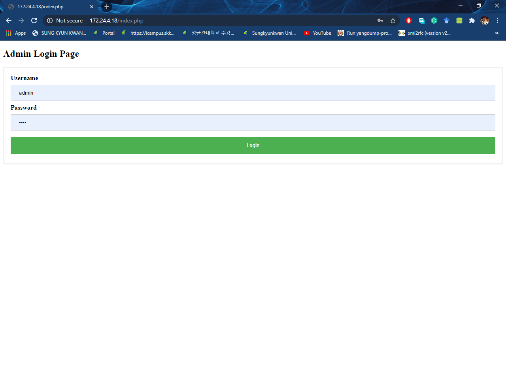
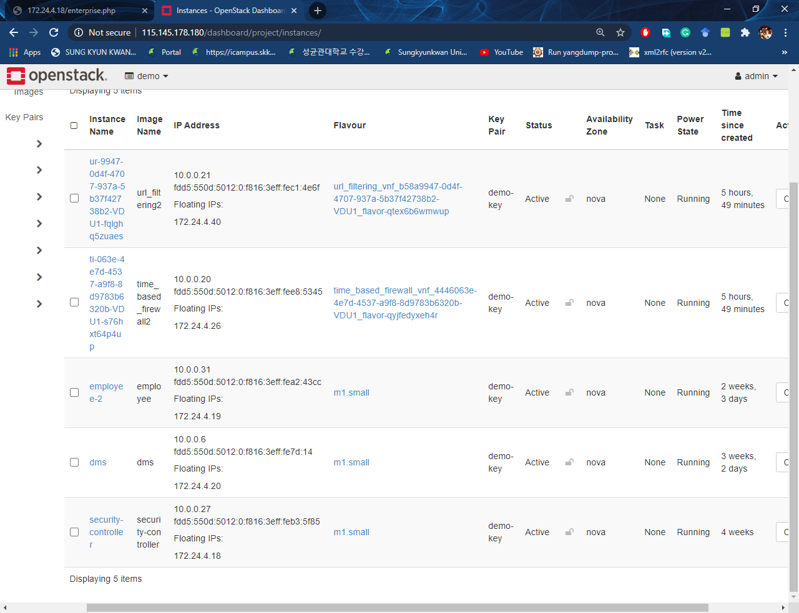
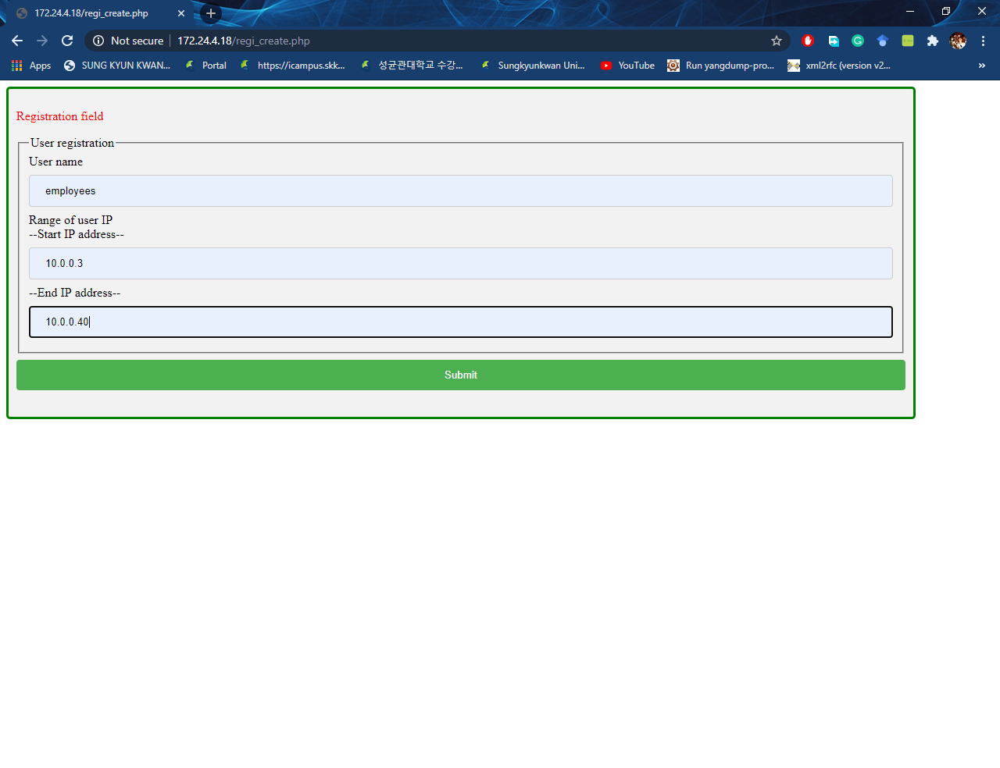
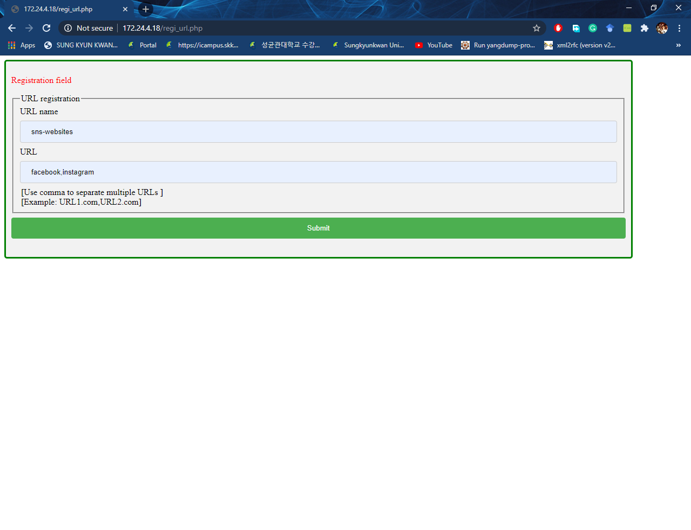
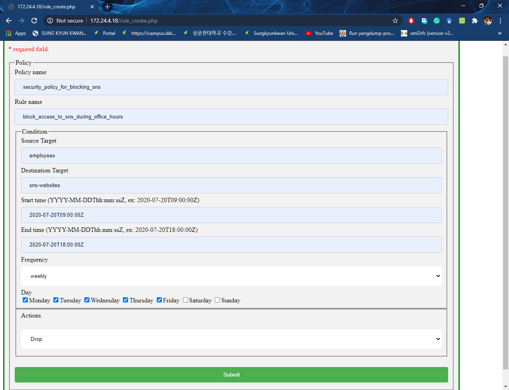

# I2NSF Hackathon Manual
### July 20-24, 2020

**Made by: Patrick Lingga (SKKU)**

**Champion: Jaehoon Paul Jeong (SKKU)**

## Environment

* OS: Ubuntu 16.04 (64-bit)
* Openstack: Queens version
* ConfD: 6.6 version
* MySQL: 14.14 version
* RestConf: JETCONF server
* Suricata: 3.2.1 Release
* Where to get code:
https://github.com/jaehoonpaul/i2nsf-framework

## Openstack Installation

The installation is installed on a freshly installed Ubuntu 16.04 Desktop version.
Installation Step:
1. Update Advanced package tool
```
$ sudo apt-get update
```
2. Create a stack user
```
$ sudo useradd -s /bin/bash -d /opt/stack -m stack
$ echo "stack ALL=(ALL) NOPASSWD: ALL" | sudo tee /etc/sudoers.d/stack
$ sudo su – stack
```
3. Download source code for from the github link    
```
$ git clone https://opendev.org/openstack/devstack
```
4. Go to devstack folder
```
$ cd devstack
```
5. Create a local.conf file
```
$ touch local.conf
```
6. Edit the local.conf file with the file from:

https://github.com/jaehoonpaul/i2nsf-framework/blob/master/Hackathon-108/devstack/local.conf

Note: Make sure to change the IP address according to your IP
address in local.conf

7. Run stack.sh
```
$ ./stack.sh
```

8. Wait until installation finish


9. Download source code
```
$ git clone https://github.com/jaehoonpaul/i2nsf-framework
```

10. Move i2nsf-framework/Hackathon-108/openstack/ to /opt/stack
```
$ mv i2nsf-framework/Hackathon-108/openstack/* /opt/stack/
```

11. Edit openstack_server.py IP address to your IP
address

## I2NSF Framework Setup

* Security Controller, DMS Server, and employee example in
Hackathon-108 use Ubuntu 16.04 cloud images.

* Download link:

http://cloud-images.ubuntu.com/xenial/current/

* Upload the image to OpenStack
```
$ glance image-create –visibility public \
    –disk-format qcow2 xenial-server-cloudimg-amd64-disk1.img
```
* Setup Security groups in Openstack so Instances are able to
connect to internet

## Security Controller

Installation:

1. Create Security Controller instance using Ubuntu 16.04 Cloud image
```
$ nova boot --image xenial-server-cloudimg-amd64-disk1 \
 --flavor m1.small --nic net-id=<private_network_id> \
 --key-name <keypair-name> security_controller   
```

2. Allocate Floating IP for Security Controller

3. Access Security Controller using SSH

4. Download the security controller source code from GitHub

5. Update Advanced package tool
```
$ sudo apt-get update
```

6. Install packages
```
$ sudo add-apt-repository ppa:deadsnakes/ppa
$ sudo apt-get update
$ sudo apt-get install python python-pip python-mysqldb \
    python-dev libmysqlclient-dev mysql-client-core-5.7 \
    libxml2-utils mysql-server apache2 php-pear libapache2-mod-php \
    php-mysql php-fpm php-cli php-mysqlnd php-pgsql php-sqlite3 \
    php-redis php-apcu php-intl php-imagick php-json php-gd php-curl \
    python3.6 python3-pip build-essential nghttp2 libnghttp2-dev \
    libssl-dev make
$ pip install numpy==1.14.6 MySQL-python
```
Notes: In this Hackathon-108 MySQL Password = secu

7. Install confd
```
$ cp /home/ubuntu/i2nsf-framework/Hackathon-108/* /home/ubuntu/
$ cd /home/ubuntu/confd-basic-linux.x86_64/
$ sh confd-basic-6.6.linux.x86_64.installer.bin /home/ubuntu/confd-6.6
$ source /home/ubuntu/confd-6.6/confdrc
```

8. Edit server.py with the proper IP address

9. Extract jetconf.tar in security_controller_web-v2
```
$ tar –xvf jetconf.tar
$ mv jetconf.tar /home/ubuntu/works/jetconf
```

10.Install JETCONF
```
$ cd /home/ubuntu/works/jetconf
$ pip install -r requirements.txt
$ python3 -m pip install .
```

11.Activate I2NSF web server for user
```
$ sudo cp -r /security_controller_web-v2/html /var/www/
```    
## DMS Server

1. Create DMS server instance using Ubuntu 16.04 Cloud image
```
$ nova boot --image xenial-server-cloudimg-amd64-disk1 \
    --flavor m1.small --nic net-id=<private_network_id> \
    --key-name <keypair-name> dms
```    

2. Allocate Floating IP for DMS Server

3. Access DMS Server using SSH

4. Download the security controller source code from GitHub

5. Update Advanced package tool
```
$ sudo apt-get update
```

6. Install packages
```
$ sudo apt-get install python python-pip python-mysqldb python-dev \
    libmysqlclient-dev mysql-client-core-5.7 libxml2-utils mysql-server \
    libxml2-utils
$ pip install numpy MySQL-python paramiko --user
```

7. Install confd
```
$ ./home/ubuntu/confd-basic-linux.x86_64/confd-basic-6.6.linux.x86_64.installer.bin \
    /home/ubuntu/confd-6.6
$ source /home/ubuntu/confd-6.6/confdrc
```

8. Edit dms_server.py with the proper IP address

## Employee example

1. Create employee instance using Ubuntu 16.04 Cloud image
```
$ nova boot --image xenial-server-cloudimg-amd64-disk1 \
    --flavor m1.small --nic net-id=<private_network_id> \
    --key-name <keypair-name> employee
```

2. Allocate Floating IP for employee

3. Access employee instance using SSH

4. Open web browser (ex: firefox)
```
$ firefox
```    
## Time-Based Firewall

1. Create Time-Based Firewall instance using Ubuntu 16.04 Cloud image
```
$ nova boot --image xenial-server-cloudimg-amd64-disk1 \
    --flavor m1.small --nic net-id=<private_network_id> \
    --key-name <keypair-name> time_based_firewall
```

2. Download the repository from GitHub

3. Move time-based-firewall to /home/ubuntu
```
$ cp -r i2nsf-framework/Hackathon-108/NSF/time-based-firewall/* \
    /home/ubuntu
 ```

4. Run install.sh
```
$ sudo su
$ sh install.sh
```

5. Wait until installation finished

6. Create an image snapshot from openstack server
```
$ nova image-create –-poll time_based_firewall \
    time_based_firewall2
```

7. Create VNFD in openstack server
```
$ tacker vnfd-create –-vnfd-file time_based_firewall_vnfd.yaml \
    time_based_firewall_vnfd
```
## URL Filtering


1. Create URL filtering instance using Ubuntu 16.04 Cloud image
```
$ nova boot --image xenial-server-cloudimg-amd64-disk1 \
    --flavor m1.small --nic net-id=<private_network_id> \
    --key-name <keypair-name> url_filtering
```

2. Download the repository from GitHub

3. Move time-based-firewall to /home/ubuntu
```
$ cp -r i2nsf-framework/Hackathon-108/NSF/url-filtering/* \
    /home/ubuntu
```

4. Run install.sh
```
$ sudo su
$ sh install.sh
```

5. Wait until installation finished

6. Create an image snapshot from openstack server
```
$ nova image-create –-poll url_filtering url_filtering2
```

7. Create VNFD in openstack server
```
$ tacker vnfd-create –-vnfd-file url_filtering_vnfd.yaml \
    url_filtering_vnfd
``` 
## Operation

1. Start Security Controller
```
# ACCESS SECURITY CONTROLLER WITH 3 CONSOLES CONNECTION (SSH)
$ ssh -i (PATH_TO_KEYPAIR) ubuntu@Sec_controller_IP
# First CONSOLE:
$ cd /home/ubuntu/Registration
$ sudo make clean all start
# Second CONSOLE:
$ cd /home/ubuntu
$ make target=testserver.py
# Third CONSOLE:
$ cd /home/ubuntu/works/jetconf
$ python3.6 run.py –c example.config
```

2. Run DMS Server
```
# ACCESS DMS WITH CONSOLES CONNECTION (SSH)
$ ssh -i (PATH_TO_KEYPAIR) ubuntu@DMS_IP
$ python dms_server.py
```

3. Start Socket For OpenStack
```
#In the openstack console, run openstack_server.py
$ . demorc
$ python openstack_server.py
```
4. Run web-based I2NSF user

\#Use a web browser and enter sec_controller_ip/index.php

\#username: admin

\#password: secu   





5. Register User-group and URL-Websites





6. Enter the configuration



7. Open employee web browser and try connect to SNS websites

8. Employee instance should not be able to connect to facebook and instagram

## Termination

1. Security Controller
\#In JETCONF console, press ctrl + c

\#Go to /home/ubuntu directory and enter
```
$ ./clean_security_controller
```

2. DMS

\#In DMS Console, press ctrl + c

3. Openstack
\#In openstack console, press ctrl + c and enter
 ```
$ python clean.py
```
# Thanks!

If you have any questions, contact email:

patricklink@skku.edu
